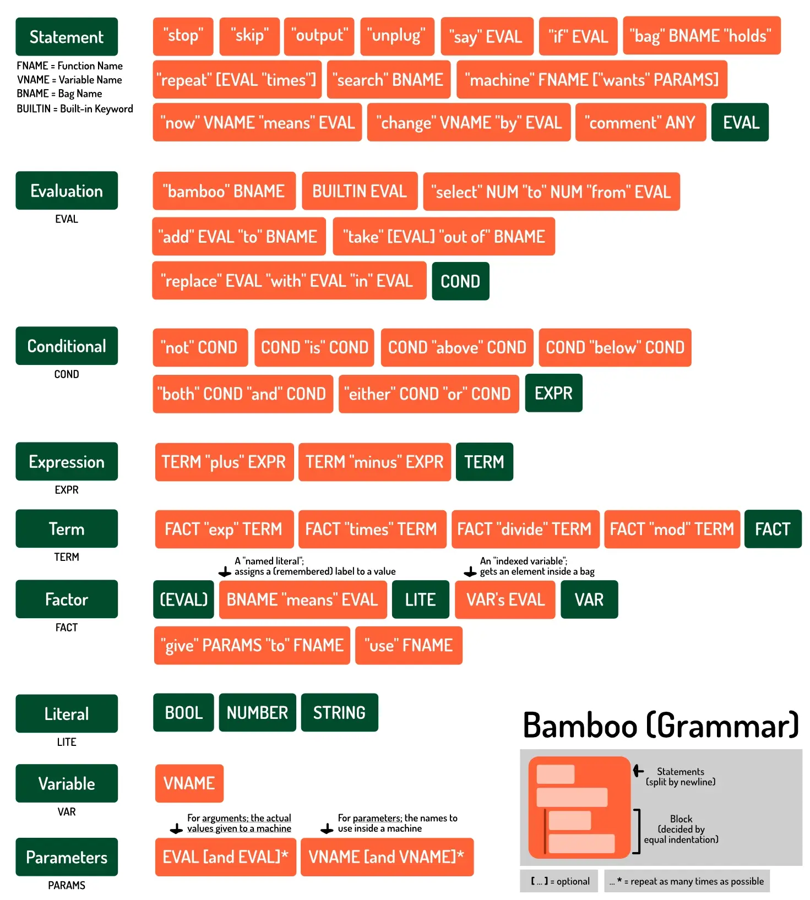
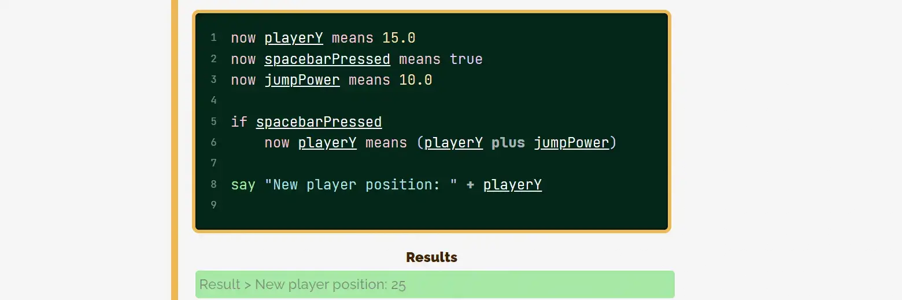

Bamboo was made to introduce people to programming. It has a limited set of features and terrible performance (if you want to do anything serious with it).

The language, therefore, aims to read like English:

* Each line is one statement. (Empty lines are just ignored)
* Everything uses _words_ as operators. (Symbols are often also supported, though.)
* Grouping happens with indentation. (Similar to Python.)
* It tries to be very dynamic. (It coerces data types, allows shenanigans, ...)

Almost all statements use this structure: `keyword value (keyword value)`.

You can read about _how_ I developed it here: [Bamboo: my own coding language](../bamboo-my-own-coding-language/).

Below is an overview of the Bamboo "grammar", with technical details left out.



## Why?

I built this for my tutorials on [Pandaqi Tutorials](https://pandaqi.com/tutorials/programming/learn-to-code). The parser is, therefore, three things in one:

* An interpreter
* An executer
* A syntax highlighter

All of that on the spot. That's why its performance will tank if you write even moderately long code.

This project has two parts:

* A JavaScript library to edit, parse and highlight this on a webpage
* The actual language syntax and grammar.

Below, both are explained (in this order).

Here's a screenshot of what Bamboo looks like on my website.



Having created this language, though, I know have a much better understanding of how to do it _well_. So I might build on this language and create a proper (fast, robust) parser in the future.

## How to use on my website?

### Load files

Load the CSS. You can edit it to create your own styling rules.

Load the JS files. 

* One is a _web worker_. 
* The other has general nodes and functionality, and can be located anywhere.

Set your path to the web worker (after loading the main library) with

```
PQ_BAMBOO.config.webWorkerUrl = "your/path/towards/it.js"
```

The Hugo shortcode is optional. Use that if you happen to be using the Hugo website generator.

### Create code blocks

Any element with the class `pq-bamboo` is converted to a code block automatically. All code blocks on a page are saved in a global variable `BAMBOO` (an array). 

You can also do it manually. Simply don't give your node this class name. Then use

```
const newBlock = new PQ_BAMBOO.CodeBlock({ parent: someParentNode });
```

It automatically creates the block and appends it to the parent.

From now on, you have an empty textarea in which to type. On change, it parses the result, highlights it, _and_ executes to give you the result.

## Expressions

There are three data types: booleans, numbers and strings.

### Boolean

Created by typing `true` or `false`

### Numbers

Just type them. Use a dot for fractions (`3.14`).

### Strings

Placed between double quotes: `"this is a string"`. That's also the only disallowed character inside it.

### Calculating

You can perform the usual calculations with this: 

* Addition: `+` or `plus`
* Subtraction: `-` or `minus`
* Multiplication: `*` or `times`
* Division: `/` or `divide`
* Modulo: `%` or `mod`
* Exponentiation: `^` or `exp`
* Grouping: `(` some expression `)`

## Debugging

### Comments

To write a comment, use the keyword `comment` (or symbol `>`).

Comments are always single line and must be on their own line.

### Output

To add anything to the log, use `say SOMETHING`.

## Variables

To declare a variable, use `now VAR means VALUE`

To change an existing numeric variable, use `change VAR by VALUE`

Variables can contain alphanumeric characters and underscores. They cannot start with a number.

## Conditionals

To compare two values (and get a boolean result), you get the usual suspects.

* Equality: `=` or `is`
* Negate: `!` or `not`
* Greater: `>` or `above`
* Less: `<` or `below`

Note how it's a single equals sign. The double equals is something that trips up new programmers, so I wanted to remove it. I have nothing against it, personally.

In the same way, logical AND and logical OR are slightly different.

* And: `both VAL1 and VAL2`
* Or: `either VAL1 or VAL2`

This is, again, to circumvent roadblocks for new coders. 

To execute a code block if the boolean is true, use the `if` statement and indent the code block after it.

```
if both (5 is 5) and (3 above 2)
    say "YES!"
```

## Bags

These are the alternative for both _arrays_ and _dictionaries_. They're not their own data type, as they're merely a collection of bools, numbers or strings.

To declare a new bag, use `bag NAME holds`. Then type every element on a new indented line after it.

By default, they'll get indices (starting from `0`). You can also name any of them with `NAME means VAL` (similar syntax to variables).

```
bag games holds
    "Mario"
    "Pacman"
    myFavorite as "Rollercoaster Tycoon"
```

To get properties of a bag, Bamboo simply uses the possessive form of English grammar: `'s`.

* Get a specific element with `BAGNAME's key`
* Get its size with `BAGNAME's size`
* Get the elements only with `BAGNAME's items`
* Get the names only with `BAGNAMES's labels`

To add or remove, use

* `add VALUE to BAGNAME` (always at the end)
* `add (KEY means VALUE) to BAGNAME`
* `take out of BAGNAME` (always last element)
* `take KEY out of BAGNAME`

## Loops

Again, Bamboo brings it back to the basics. You get a `repeat` statement: the indented code block after it will be infinitely repeated. 

* Call `stop` when needed, to stop looping
* Use `skip` to immediately move to the next loop iteration.

There are some shorthands, though.

* `repeat X times`: repeats the loop the given number of times
* `search NUMBERED BAG`: loops over all elements inside a bag (with only numbered keys)

The language automatically provides two things inside a loop:

* `bamboo iterator` is the current iterator ( = number of loop iterations already done)
* `bamboo value` is the current value (if iterating over a bag)

## Machines

I discussed this a lot with people and thought about it for a while. In the end, the best analogy (to us) for **functions** was that of a machine or device. You give it input, it will always do the same thing (it's a mechanical machine!), and then give you output.

That seemed a good real-world analogy for what functions do. As such, Bamboo calls them **machines**.

To define one,

```
machine NAME wants PARAMS
    ... code here ...
```

Machine names follow the same rules as variable names.

Parameters are supplied in written form, combined with `and`: `param1 and param2 and param3 ...`

* To return from a function, call `output`. The last expression will be the return value.
* The keyword `unplug` is an alternative and also immediately stops execution of the machine.

This is a general rule in Bamboo. Every expression evaluates to something, and the last value of a block is always returned.

* To call one without parameters, use ... `use NAME`.
* To call one with parameters, use `give PARAMS to NAME`

Remember that this is just an expression that will output the final value of the machine. So you can use it like a value/variable wherever.

```
machine adder wants a and b
    a + b

say "Result: " + (give 2 and 2 to adder)
```

## Data manipulation

Lastly, Bamboo has some useful built-in keywords for number or string manipulation. These do _not_ need to be "prefixed" with `bamboo`. (That's only necessary for keywords that don't take any input.)

### Numbers

* `number VAL`: tries to parse what comes after as a number
* `round`: rounds to nearest integer
* `floor`: rounds down to nearest integer
* `ceiling`: rounds up to nearest integer
* `abs`: gets the absolute value. (The value without minus sign, if it previously had one.)

### Strings

* `string VAL`: tries to parse what comes after as a string
* `STRING's size`: gets the number of characters in the string
* `STRING's <number>`: gets the symbol at that index in the string
* `STRING's <substring>`: gets the index of that substring in the string (-1 otherwise)
* `uppercase STR`: transforms all characters to uppercase
* `lowercase STR`: transforms all characters to lowercase
* `replace STR1 with STR2 in STR`: does what it says
* `select IDX1 to IDX2 from STR`: selects the substring between the given indices

As usual, strings are immutable. If you want to _change_ a specific part of a string, create a new string with the changed part included.

## Bamboo

Any global functionality (that needs no value(s) as input) is accessible as `bamboo <something>`.

* `bamboo random` => returns a random number between `0` and `1`
* `bamboo time` => returns a bag with `year`, `month`, `day`, `hours`, `minutes`, `seconds`, `milliseconds`


## Future

These are to-dos or ideas for the future. Or optional alternative syntaxes I might implement.

### General

* Fix and complete the testing suite 
* Find cleaner implementation for converting something that might be a variable, name or evaluation into a key
  * Saving labels on values ("named literals") actually feels very powerful?
  * Maybe I should streamline that: any literal is automatically saved as a named literal/variable? So we know the exact object we're getting and can just call one function on that.
* Include `bamboo profile` (or something) to actually test how fast code runs, for the "programming principles" course.

### Statements

* Allow multiline statements on a single line?
  * Use `then` for statements => `if 5 is 5 then dothis` 
  * But what to do for other things? Like bags? Double colon? `bag BAG holds: elem1 elem2 ...`

### Operators

* I play around with the idea of only supporting addition and multiplication. You can simply invert any value by typing `invert` => `5 - 5` = `5 plus invert 5`; `2 / 4` = `2 times invert 4`
* I couldn't find a word alternative for grouping. It's just too verbose and inefficient. `group a b c d group`?

### Variables

* `put VAL into VAR`
* `set VAR to VAL`
* `make VAR VAL`
* `call VAL VAR`
* `label VAR as VAL`
* `add VAL to VAR`
* `update VAR by VAL`

### Conditionals

Drop the if entirely? Just add a question mark at the end? => `5 is 5?`

### Loops

* `repeat A to B`: loops between the two values
* Add `skip X` to skip ahead that number of loops?
* I considered using "rummage" or "comb" for the bag loops. They are great words ... unless you're not that familiar with their meaning.

### Bags

* Allow initializing _empty bags_ with simply `bag BAGNAME`?

### Machines

* Allow saving a reference to a _machine_ inside a variable or bag
* Perhaps shorthand syntax for this:
  * `use FUNC from BAG with PARAMS`
  * `give PARAMS to NAME and output to VAR`

### Bamboo

Use the `bamboo <something>` more. I considered some (very rudimentary) 

* Built-in drawing,
* Update loop (for games)
* Asynchronous stuff
* Access to file system, alerts, keyboard/mouse input, etcetera. 
